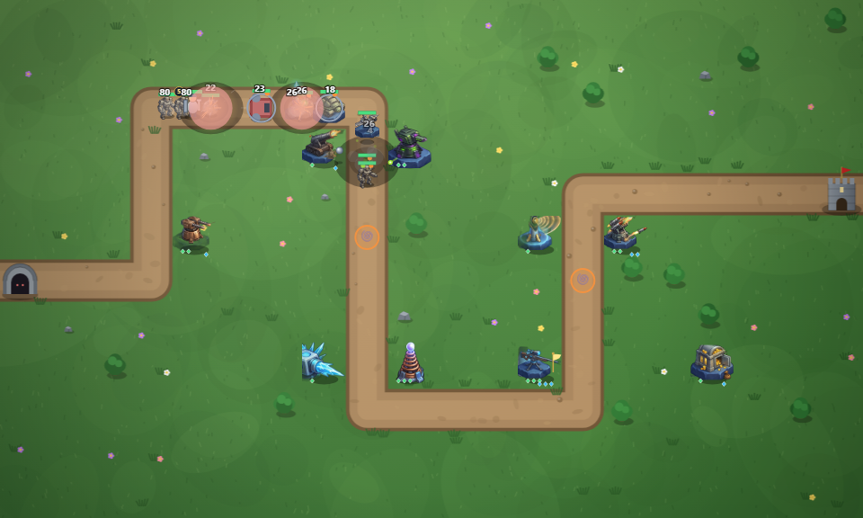
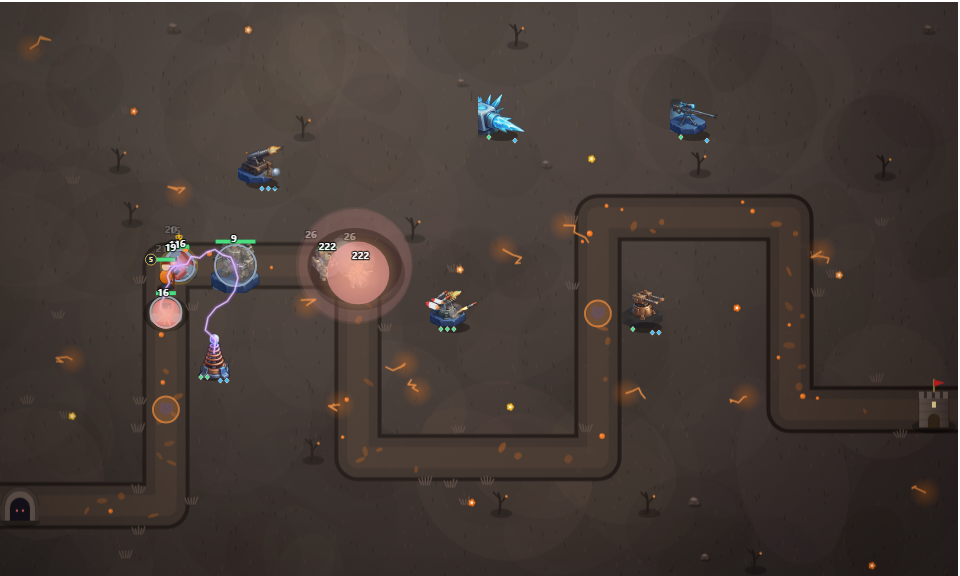
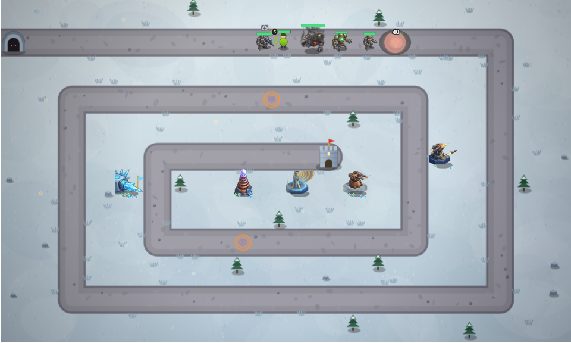
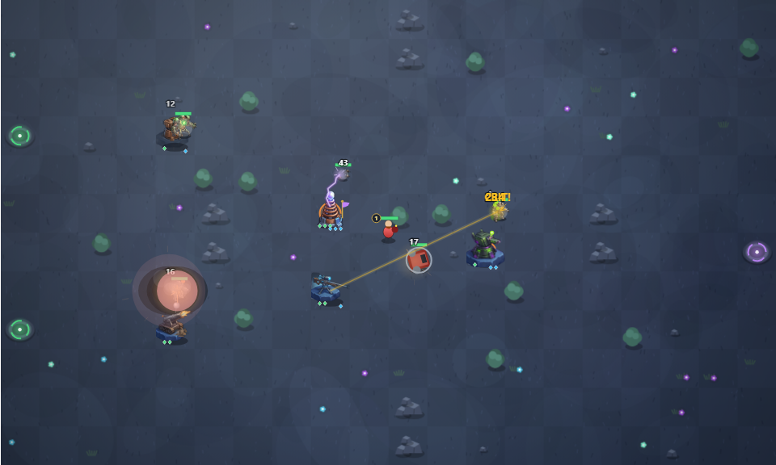

# Bastion TD

**▶ Play now: https://ozspidey.github.io/Bastion-TD/**

A production tower defense game built from the best ideas in the genre. One JavaScript codebase ships to three targets: web (GitHub Pages), Android (Play Store) and iOS (App Store) via Capacitor. All builds run in GitHub Actions, nothing needs to be installed locally.

## Play

1. **Web**: **https://ozspidey.github.io/Bastion-TD/** — deployed automatically to GitHub Pages on every push to `main`.
2. **Local**: open `www/index.html` in any browser.

## Screenshots

| Green Meadow — towers, hero and a relic carrier | Cinder Peak — tesla arcs over molten ground |
|---|---|
|  |  |

| Frozen Spiral — frost and snipers hold the rings | Twin Gates — maze building in the twilight |
|---|---|
|  |  |

## Design pedigree

| System | Inspired by |
|---|---|
| Dual upgrade paths per tower, every placement is a build decision | Bloons TD 6 |
| Active commander abilities on cooldown | Kingdom Rush |
| Persistent research tree and endless scaling | Infinitode 2 |
| Open-field maze building where towers block the path | Desktop TD, Dungeon Warfare |
| Handcrafted map variety and kill-zone pacing | Defense Grid |

## Features

1. **6 modes**: Campaign (7 maps, 3 difficulties, 63 stars), Endless, Maze (flow-field pathfinding), Boss Rush, date-seeded Daily Challenge with mutators + streak bonuses, Sandbox.
2. **10 maps, 7 painterly themes**: grass, autumn, canyon, snow, twilight, volcanic (glowing lava cracks), desert oasis.
3. **9 towers**, each with 2 upgrade paths of 3 tiers, exact-stat hover tooltips and per-tower damage tallies.
4. **5 heroes** (tank / archer / fire mage / cleric / demolitionist) that block enemies, level up persistently across matches and auto-cast signature abilities.
5. **11 enemy types**: armor, flying, stealth, regeneration, splitting, swarms, 2 bosses; first-encounter intro cards.
6. **3 commander abilities**, 8 permanent research perks, 10 achievements, lifetime statistics.
7. **Juice**: per-tower attack effects (chained lightning, lobbed shells, rocket trails, venom splats), particles, screen shake, floating damage numbers, hit flashes, procedural chiptune music with battle intensity.
8. Wave preview with threat warnings, contextual first-game tutorial, animated menu, victory confetti.
9. Touch and mouse input, responsive layout, save data in localStorage, zero data collection ([privacy](www/privacy.html)).

## Custom art

The game ships with procedural vector art: rotating turrets with recoil and muzzle flash, animated enemies with unique silhouettes. To replace any of it with painted sprites, drop transparent PNGs at:

1. `www/assets/towers/<id>.png` (top-down, facing right): gunner, cannon, frost, tesla, venom, sniper, missile, bank, beacon
2. `www/assets/enemies/<id>.png` (top-down, facing up): runt, sprinter, swarmling, brute, winged, phantom, regenerator, shellback, splitter, juggernaut, wyvern
3. `www/assets/heroes/<id>.png` (3/4 view, facing right): aldric, lyra, magnus, mercy, korg

The engine detects them at load time, no code changes needed. Towers render at 44px and enemies at about 2.7x their radius, so 128px or 256px source images are plenty.

## Repository layout

```
www/                      the game (no build step, plain HTML/CSS/JS)
resources/                source icon and splash (1024px / 2732px)
capacitor.config.json     app id, name, webDir
.github/workflows/
  deploy-web.yml          GitHub Pages deploy on push
  android-build.yml       Android build
  ios-build.yml           unsigned iOS compile check (manual)
```

The `android/` and `ios/` native projects are generated fresh in CI by `npx cap add`, so they are gitignored.

## Rights

Copyright © OzSpidey. All rights reserved. The source is visible for reference and personal builds only — no license is granted to redistribute, republish, or upload this game or derivatives to any app store or website.
